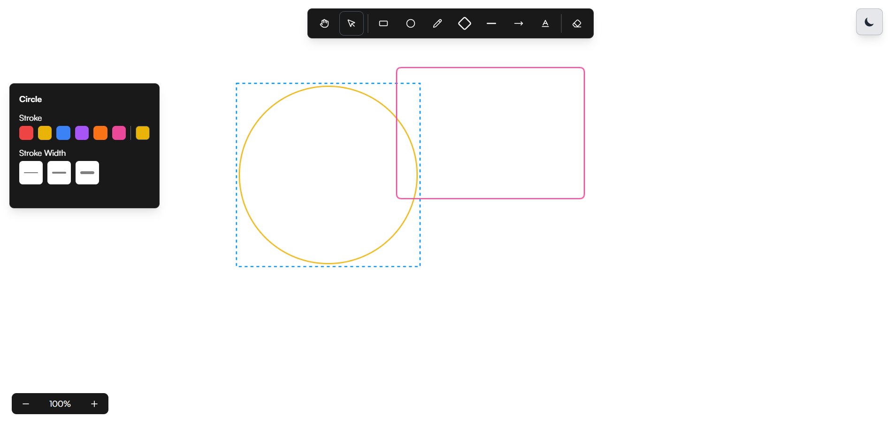
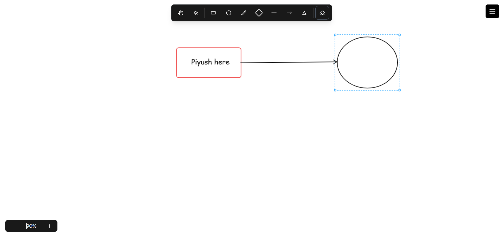
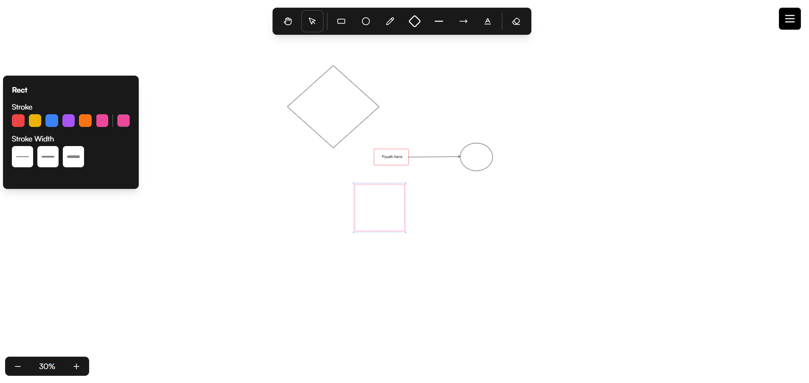

# Slapdash - Collaborative Drawing App

A real-time collaborative drawing application built as an Excalidraw clone with advanced features like zooming, panning, and multi-user collaboration.

## Features

- **Real-time Collaboration**: Draw together with multiple users in real-time
- **Advanced Drawing Tools**: Rectangle, circle, diamond, line, arrow, text, and freehand drawing
- **Zoom & Pan**: Smooth zooming and panning functionality for detailed work
- **Shape Selection**: Click to select and modify shapes with resize handles
- **Color & Stroke Customization**: Change colors and stroke widths for any shape
- **Dark/Light Theme**: Toggle between themes for comfortable viewing
- **Responsive Design**: Works seamlessly across different screen sizes

## Screenshots







## Tech Stack

- **Frontend**: Next.js, React, TypeScript
- **Real-time Communication**: WebSockets
- **Drawing Engine**: HTML5 Canvas API
- **Backend**: Node.js
- **Monorepo Management**: Turborepo
- **Styling**: Tailwind CSS
- **Authentication**: NextAuth.js
- **Database**: Prisma with PostgreSQL

## Getting Started

### Prerequisites

- Node.js 18+ 
- pnpm (recommended) or npm
- PostgreSQL database

### Installation

1. Clone the repository:
```bash
git clone <repository-url>
cd drawApp(excalidraw)
```

2. Install dependencies:
```bash
pnpm install
```

3. Set up environment variables:
```bash
cp .env.example .env
# Fill in your database and authentication credentials
```

4. Run database migrations:
```bash
pnpm db:migrate
```

5. Start the development server:
```bash
pnpm dev
```

The application will be available at `http://localhost:3000`

## Project Structure

```
drawApp(excalidraw)/
├── apps/
│   ├── excalidraw-frontend/    # Main drawing application
│   ├── web/                    # Web interface
│   ├── http-backend/           # HTTP API server
│   └── ws-backend/             # WebSocket server
├── packages/
│   ├── backend-common/         # Shared backend utilities
│   ├── common/                 # Shared types and utilities
│   ├── db/                     # Database schema and migrations
│   └── ui/                     # Shared UI components
└── docker/                     # Docker configuration
```

## Development

### Available Scripts

- `pnpm dev` - Start all applications in development mode
- `pnpm build` - Build all applications and packages
- `pnpm lint` - Run ESLint across all packages
- `pnpm test` - Run tests across all packages

### Key Components

- **Game.ts**: Core drawing engine with canvas manipulation
- **Canvas.tsx**: Main canvas component with event handling
- **ShapeConfigModal.tsx**: Shape property configuration
- **WebSocket Handlers**: Real-time collaboration logic

## Contributing

1. Fork the repository
2. Create a feature branch
3. Make your changes
4. Add tests if applicable
5. Submit a pull request

